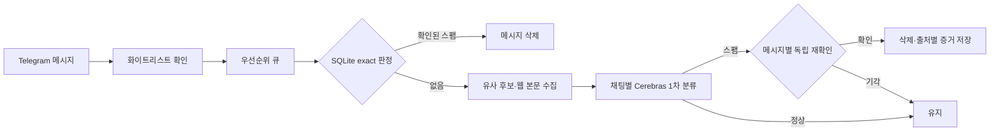

# fuckyou-spam-rust

Telegram 그룹의 메시지를 SQLite 스팸 캐시와 Cerebras AI로 분류하고 스팸 메시지를 삭제하는 Rust 봇입니다.

## 주요 기능

- Telegram long polling 기반 메시지 수신
- SQLite 화이트리스트와 판정 캐시
- 확인된 동일 메시지의 LLM 호출 생략
- 채팅별 비가역 유사 해시를 LLM 판단 근거로 활용
- 사용자·채팅별 요청 제한과 bounded 우선순위 큐
- 채팅별 일괄 AI 분류 후 스팸 건별 독립 재확인
- URL 본문 추출과 분석
- 종료 신호 처리와 Docker 재시작 정책

## 처리 흐름



## Docker Compose

Docker와 Docker Compose v2가 필요합니다.

```bash
cp .env.example .env
docker compose up -d --build
docker compose logs -f spam-bot
```

`TELEGRAM_BOT_TOKEN`과 `CEREBRAS_API_KEY`는 필수입니다. `BOT_USERNAME`, 관리자 ID, 허용 채팅 ID는 운영 환경에 맞게 입력합니다.

Compose는 다음 운영 기본값을 적용합니다.

- 단일 컨테이너
- CPU 1개, 메모리 512MB, PID 128개 상한
- 비루트 사용자와 읽기 전용 루트 파일시스템
- 모든 Linux capability 제거
- 60초 종료 유예
- `/app/data` named volume 영속화
- stdout 로그와 Docker 로그 순환
- SQLite와 처리 루프 heartbeat 헬스체크
- 컨테이너 내부 자동 업데이트와 예약 재시작 비활성화

SQLite DB, WAL, 런타임 잠금은 `bot-data` named volume에 저장됩니다. `docker compose down`은 데이터를 유지하지만 `docker compose down -v`는 볼륨까지 삭제합니다.

Compose는 파일 로그를 끄고 stdout만 사용합니다. 애플리케이션 초기화를 위한 쓰기 가능한 로그 경로는 `/tmp/logs`로 두며 컨테이너 재생성 시 제거됩니다. 운영 로그의 기준은 `docker compose logs`와 Dokploy 로그 뷰어입니다.

메시지 수집은 기본적으로 60초당 사용자 12건, 채팅 120건으로 제한됩니다. 제한 상태와 멤버십 캐시는 메모리 상한과 만료 시간을 가지며 재시작 시 초기화됩니다.

## Dokploy

Dokploy에서 서비스 유형을 `Compose`로 만들고 Compose Path를 `compose.yaml`로 설정합니다.

1. 저장소와 배포 브랜치를 연결합니다.
2. Environment 탭에 `.env.example`의 키를 등록하고 비밀값을 입력합니다.
3. Docker Compose 모드를 선택하고 배포합니다.
4. replica는 1개로 유지합니다.
5. 포트와 도메인은 등록하지 않습니다.
6. `bot-data` named volume에 S3 Volume Backup을 설정합니다.

Dokploy는 Environment 탭 값을 Compose 파일 옆의 `.env`로 저장하며, `env_file`이 이를 컨테이너에 주입합니다. `COMPOSE_PROJECT_NAME`, Dokploy 애플리케이션 이름, `bot-data` 볼륨 이름을 변경하면 기존 볼륨 연결이 달라질 수 있습니다.

SQLite 백업은 Volume Backup의 `Turn off Container`를 활성화한 상태로 트래픽이 적은 시간에 실행하는 것이 안전합니다. WAL 모드는 같은 호스트의 로컬 named volume에서만 사용하고 NFS·CIFS 공유 볼륨에는 두지 않습니다.

Compose에는 `build`만 두고 고정된 로컬 `image` 이름을 사용하지 않습니다. 이 구성은 Dokploy 프로젝트 간 이미지 이름 충돌과 불필요한 pull 시도를 피합니다. CI에서 이미지를 발행하는 방식으로 전환할 때는 `build`를 제거하고 registry의 커밋 SHA 태그 또는 digest만 사용합니다.

컨테이너에서는 아래 값이 Compose에 의해 강제로 적용됩니다.

```env
AUTO_UPDATE_ENABLED=false
DATA_DIR=/app/data
LOG_TO_FILE=false
LOGS_DIR=/tmp/logs
RESTART_CRONS=
```

업데이트는 컨테이너 내부 바이너리 교체가 아니라 Git push 후 Dokploy 재배포로 수행합니다.

- [Dokploy Docker Compose](https://docs.dokploy.com/docs/core/docker-compose)
- [Dokploy Volume Backups](https://docs.dokploy.com/docs/core/volume-backups)
- [SQLite WAL](https://www.sqlite.org/wal.html)

## 소스 실행

```bash
cargo build --release --locked
cargo run --release --locked
```

소스 실행에서 예약 재시작이 필요하지 않으면 `.env`의 `RESTART_CRONS`를 빈 값으로 유지합니다. systemd나 Docker 같은 프로세스 관리자가 있을 때는 내부 재시작과 자동 업데이트를 함께 사용하지 않는 것이 안전합니다.

## 환경변수

| 변수 | 기본값 | 설명 |
| --- | --- | --- |
| `TELEGRAM_BOT_TOKEN` | 없음 | Telegram BotFather 토큰 |
| `BOT_USERNAME` | 없음 | `@`를 제외한 봇 사용자명 |
| `ADMIN_USER_ID` | 없음 | 화이트리스트 관리 사용자 ID |
| `ADMIN_GROUP_ID` | 없음 | 관리 알림 그룹 ID |
| `ALLOWED_CHAT_IDS` | 없음 | 초기 허용 채팅 ID 목록 |
| `CEREBRAS_API_KEY` | 없음 | Cerebras API 키 |
| `CEREBRAS_MODEL` | `gpt-oss-120b` | 분류 모델 |
| `CEREBRAS_REQUEST_TIMEOUT_SECS` | `45` | Cerebras 요청 제한 시간 |
| `LOG_LEVEL` | `info` | 로그 레벨 |
| `LOG_TO_FILE` | `false` | 일별 파일 로그 사용 여부 |
| `LOGS_DIR` | `logs` | 파일 로그 디렉터리 |
| `DATA_DIR` | `data` | SQLite 데이터 디렉터리 |
| `DB_FILENAME` | `whitelist.db` | SQLite 파일명 |
| `MAX_URLS_PER_MESSAGE` | `2` | 메시지당 URL 처리 상한 |
| `WEBPAGE_FETCH_TIMEOUT` | `10000` | URL 요청 제한 시간(ms) |
| `WEBPAGE_CONTENT_MAX_LENGTH` | `1000` | AI 입력용 본문 문자 상한 |
| `WEBPAGE_RESPONSE_MAX_BYTES` | `1048576` | URL 응답 읽기 상한 |
| `WEBPAGE_BLOCKED_IPS` | 없음 | 서버 공인 IP 등 추가 차단 주소 |
| `QUEUE_MAX_MESSAGES` | `5000` | 전체 큐 상한 |
| `QUEUE_HIGH_PRIORITY_MAX` | `1000` | 높은 우선순위 큐 상한 |
| `QUEUE_NORMAL_PRIORITY_MAX` | `4000` | 일반 우선순위 큐 상한 |
| `PROCESSOR_BATCH_MAX_MESSAGES` | `30` | AI 요청당 메시지 상한 |
| `PROCESSOR_BATCH_MAX_CHARS` | `48000` | AI 요청당 전체 문자 상한 |
| `PROCESSOR_RETRY_ATTEMPTS` | `3` | 일시 오류 재시도 횟수 |
| `PROCESSOR_MAX_REQUEUES` | `5` | 분류 실패 작업 재큐잉 상한 |
| `PROCESSOR_RETRY_BASE_DELAY_MS` | `500` | 재시도 기본 지연 |
| `WEB_FETCH_CONCURRENCY` | `4` | URL 동시 요청 상한 |
| `SPAM_CACHE_SIMILARITY_THRESHOLD` | `0.92` | LLM에 제공할 유사 후보 임계값 |
| `SPAM_CACHE_SCAN_LIMIT` | `1000` | 유사도 비교 후보 상한 |
| `SPAM_CACHE_MIN_NORMALIZED_CHARS` | `8` | 캐시 대상 최소 정규화 길이 |
| `SPAM_CACHE_POLICY_VERSION` | `2026-07-v3` | 캐시 판정 정책 버전 |
| `SPAM_CACHE_NORMALIZER_VERSION` | `3` | 정규화 규칙 버전 |
| `SPAM_CACHE_TENTATIVE_TTL_SECS` | `86400` | 잠정 스팸 보존 시간 |
| `SPAM_CACHE_CONFIRMED_TTL_SECS` | `7776000` | 확인된 스팸 보존 시간 |
| `SPAM_CACHE_PRUNE_INTERVAL_SECS` | `3600` | 만료 캐시 정리 주기 |
| `BOT_TIMEZONE` | `Asia/Seoul` | 스케줄 기준 시간대 |
| `RESTART_CRONS` | 빈 값 권장 | 내부 재시작 cron 목록 |
| `NETWORK_ERROR_THRESHOLD` | `5` | 네트워크 오류 임계값 |
| `NETWORK_ERROR_WINDOW_SECS` | `60` | 네트워크 오류 집계 구간 |
| `EMERGENCY_RESTART_COOLDOWN_SECS` | `600` | 비상 재시작 간격 |
| `AUTO_UPDATE_ENABLED` | `false` | 릴리스 자동 업데이트 |
| `AUTO_UPDATE_CHECK_ON_STARTUP` | `true` | 시작 시 업데이트 확인 |
| `AUTO_UPDATE_AUTO_RESTART` | `true` | 업데이트 후 재실행 |
| `AUTO_UPDATE_REPO_OWNER` | `yldst-dev` | 릴리스 저장소 소유자 |
| `AUTO_UPDATE_REPO_NAME` | `fuckyou-spam-rs` | 릴리스 저장소 이름 |
| `AUTO_UPDATE_ALLOWED_REPO_OWNERS` | `yldst-dev` | 허용 저장소 소유자 목록 |
| `AUTO_UPDATE_ALLOWED_REPO_NAMES` | `fuckyou-spam-rs` | 허용 저장소 이름 목록 |
| `AUTO_UPDATE_ASSET_HOST_ALLOWLIST` | GitHub 릴리스 호스트 | 허용 다운로드 호스트 |
| `AUTO_UPDATE_MAX_DOWNLOAD_BYTES` | `52428800` | 릴리스 다운로드 상한 |
| `AUTO_UPDATE_ASSET_SHA256` | 없음 | 자동 업데이트 활성화 시 필수인 외부 검증 SHA-256 |

## 관리 명령

- `/start`
- `/help`
- `/status`
- `/chatid`
- `/ping`
- `/whitelist_add`
- `/whitelist_remove`
- `/whitelist_list`
- `/sync_commands`

## 아키텍처

상세 구조와 배포 제약은 [docs/ARCHITECTURE.md](docs/ARCHITECTURE.md)를 참고하십시오.

## 라이선스

MIT
