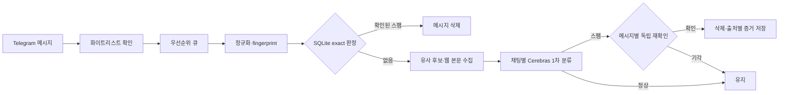

# fuckyou-spam-rust

Telegram 그룹의 메시지를 SQLite 스팸 캐시와 Cerebras AI로 분류하고 스팸 메시지를 삭제하는 Rust 봇입니다.

## 주요 기능

- Telegram long polling 기반 메시지 수신
- SQLite 화이트리스트와 판정 캐시
- 확인된 동일 메시지의 LLM 호출 생략
- 원문을 저장하지 않는 채팅별 64비트 유사도 해시를 LLM 판단 근거로 활용
- 사용자·채팅별 요청 제한과 bounded 우선순위 큐
- 채팅별 일괄 AI 분류 후 스팸 건별 독립 재확인
- URL 본문 추출과 분석
- 종료 신호 처리와 Docker 기반 수명주기 관리

## 처리 흐름



## Docker Compose

Docker와 Docker Compose v2가 필요합니다.

```bash
cp .env.example .env
docker compose up -d --build
docker compose logs -f spam-bot
```

`TELEGRAM_BOT_TOKEN`과 `CEREBRAS_API_KEY`는 필수입니다. `BOT_USERNAME`, 관리자 ID, 허용 채팅 ID는 운영 환경에 맞게 입력합니다.

Compose는 다음 운영 기본값을 적용합니다.

- 단일 컨테이너
- CPU 1개, 메모리 512MB, PID 128개 상한
- 비루트 사용자와 읽기 전용 루트 파일시스템
- 모든 Linux capability 제거
- 60초 종료 유예
- `/app/data` named volume 영속화
- stdout 로그와 Docker 로그 순환
- SQLite와 처리 루프 heartbeat 헬스체크
- Docker와 Dokploy가 담당하는 재시작 및 배포 수명주기

SQLite DB, WAL, 런타임 잠금은 `bot-data` named volume에 저장됩니다. `docker compose down`은 데이터를 유지하지만 `docker compose down -v`는 볼륨까지 삭제합니다.

Compose는 파일 로그를 끄고 stdout만 사용합니다. 애플리케이션 초기화를 위한 쓰기 가능한 로그 경로는 `/tmp/logs`로 두며 컨테이너 재생성 시 제거됩니다. 운영 로그의 기준은 `docker compose logs`와 Dokploy 로그 뷰어입니다.

메시지 수집은 기본적으로 60초당 사용자 12건, 채팅 120건으로 제한됩니다. 제한 상태와 멤버십 캐시는 메모리 상한과 만료 시간을 가지며 재시작 시 초기화됩니다.

## Dokploy

Dokploy에서는 `compose.yaml`을 사용하는 Compose 프로젝트로 배포하고 replica를 1개로 유지합니다. 공개 포트와 도메인은 필요하지 않으며 업데이트와 재시작은 Git 배포, Dokploy, Docker가 담당합니다.

환경변수 설정, SQLite 볼륨 백업, 이미지 공급망과 배포 검증 절차는 [Dokploy Compose 배포 문서](docs/DEPLOY_DOKPLOY.md)를 참고하십시오.

## 소스 실행

```bash
cargo build --release --locked
cargo run --release --locked
```

## 환경변수

| 변수 | 기본값 | 설명 |
| --- | --- | --- |
| `TELEGRAM_BOT_TOKEN` | 없음 | Telegram BotFather 토큰 |
| `BOT_USERNAME` | 없음 | `@`를 제외한 봇 사용자명 |
| `ADMIN_USER_ID` | 없음 | 화이트리스트 관리 사용자 ID |
| `ADMIN_GROUP_ID` | 없음 | 관리 알림 그룹 ID |
| `ALLOWED_CHAT_IDS` | 없음 | 초기 허용 채팅 ID 목록 |
| `CEREBRAS_API_KEY` | 없음 | Cerebras API 키 |
| `CEREBRAS_MODEL` | `gpt-oss-120b` | 분류 모델 |
| `CEREBRAS_REQUEST_TIMEOUT_SECS` | `45` | Cerebras 요청 제한 시간 |
| `LOG_LEVEL` | `info` | 로그 레벨 |
| `LOG_TO_FILE` | `false` | 일별 파일 로그 사용 여부 |
| `LOGS_DIR` | `logs` | 파일 로그 디렉터리 |
| `DATA_DIR` | `data` | SQLite 데이터 디렉터리 |
| `DB_FILENAME` | `whitelist.db` | SQLite 파일명 |
| `MAX_URLS_PER_MESSAGE` | `2` | 메시지당 URL 처리 상한 |
| `WEBPAGE_FETCH_TIMEOUT` | `10000` | URL 요청 제한 시간(ms) |
| `WEBPAGE_CONTENT_MAX_LENGTH` | `1000` | AI 입력용 본문 문자 상한 |
| `WEBPAGE_RESPONSE_MAX_BYTES` | `1048576` | URL 응답 읽기 상한 |
| `WEBPAGE_BLOCKED_IPS` | 없음 | 서버 공인 IP 등 추가 차단 주소 |
| `QUEUE_MAX_MESSAGES` | `5000` | 전체 큐 상한 |
| `QUEUE_HIGH_PRIORITY_MAX` | `1000` | 높은 우선순위 큐 상한 |
| `QUEUE_NORMAL_PRIORITY_MAX` | `4000` | 일반 우선순위 큐 상한 |
| `PROCESSOR_BATCH_MAX_MESSAGES` | `30` | AI 요청당 메시지 상한 |
| `PROCESSOR_BATCH_MAX_CHARS` | `48000` | AI 요청당 전체 문자 상한 |
| `PROCESSOR_RETRY_ATTEMPTS` | `3` | 일시 오류 재시도 횟수 |
| `PROCESSOR_MAX_REQUEUES` | `5` | 분류 실패 작업 재큐잉 상한 |
| `PROCESSOR_RETRY_BASE_DELAY_MS` | `500` | 재시도 기본 지연 |
| `WEB_FETCH_CONCURRENCY` | `4` | URL 동시 요청 상한 |
| `SPAM_CACHE_SIMILARITY_THRESHOLD` | `0.92` | LLM에 제공할 유사 후보 임계값 |
| `SPAM_CACHE_SCAN_LIMIT` | `1000` | 유사도 비교 후보 상한 |
| `SPAM_CACHE_MIN_NORMALIZED_CHARS` | `8` | 캐시 대상 최소 정규화 길이 |
| `SPAM_CACHE_POLICY_VERSION` | `2026-07-v3` | 캐시 판정 정책 버전 |
| `SPAM_CACHE_NORMALIZER_VERSION` | `3` | 정규화 규칙 버전 |
| `SPAM_CACHE_TENTATIVE_TTL_SECS` | `86400` | 잠정 스팸 보존 시간 |
| `SPAM_CACHE_CONFIRMED_TTL_SECS` | `7776000` | 확인된 스팸 보존 시간 |
| `SPAM_CACHE_PRUNE_INTERVAL_SECS` | `3600` | 만료 캐시 정리 주기 |
| `BOT_TIMEZONE` | `Asia/Seoul` | 관리 알림 표시 시간대 |
| `NETWORK_ERROR_THRESHOLD` | `5` | 네트워크 오류 임계값 |
| `NETWORK_ERROR_WINDOW_SECS` | `60` | 네트워크 오류 집계 구간 |
| `EMERGENCY_RESTART_COOLDOWN_SECS` | `600` | 볼륨에 유지되는 비상 재시작 최소 간격 |

## 관리 명령

- `/start`
- `/help`
- `/status`
- `/chatid`
- `/ping`
- `/whitelist_add`
- `/whitelist_remove`
- `/whitelist_list`
- `/sync_commands`

## 아키텍처

상세 구조와 배포 제약은 [docs/ARCHITECTURE.md](docs/ARCHITECTURE.md)를 참고하십시오.

## 라이선스

MIT
