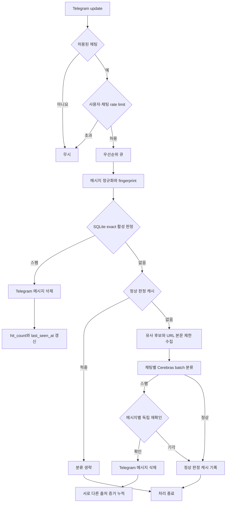
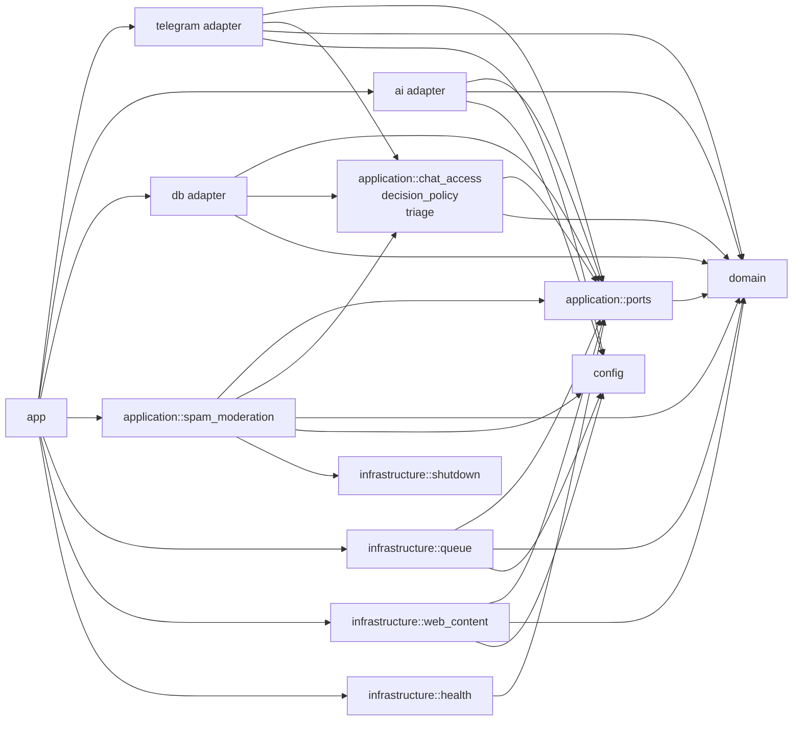
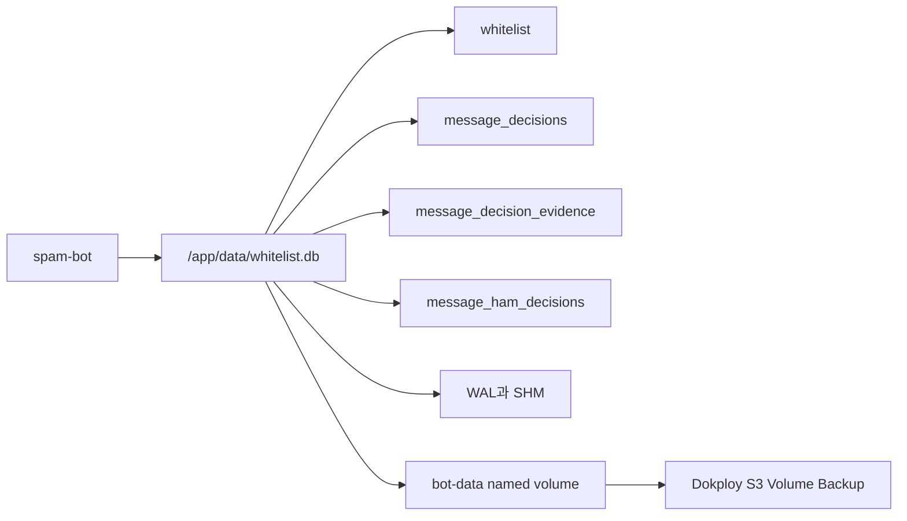
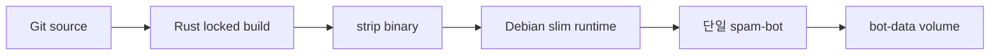
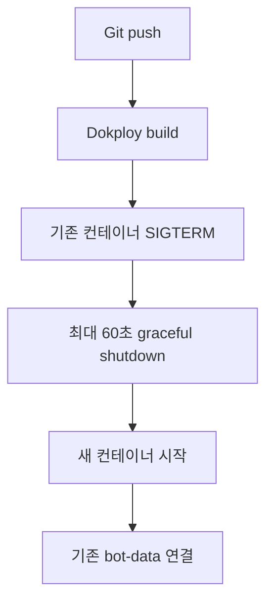

# 아키텍처

## 목표

- Telegram 그룹 메시지를 빠르게 수집하고 우선순위에 따라 처리합니다.
- 이미 확인된 스팸은 SQLite 캐시에서 판별해 LLM 호출을 줄입니다.
- 최근 정상으로 확인된 메시지는 짧은 TTL의 정상 판정 캐시로 재분류를 건너뜁니다.
- 새로운 메시지만 웹 본문과 함께 Cerebras에 전달합니다.
- Docker와 Dokploy에서는 단일 replica와 영속 SQLite 볼륨을 사용합니다.

## 메시지 처리

캐시 조회가 실패하면 메시지를 정상으로 확정하지 않고 LLM 분류로 진행합니다. 활성 상태인 채팅별 exact 스팸 판정만 자동 삭제하며 유사 후보는 같은 채팅의 LLM 재검증 근거로만 사용합니다. 일괄 판정에서 스팸으로 나온 메시지는 다른 메시지와 분리해 다시 확인한 뒤 삭제합니다. 최초 스팸 판정은 잠정 상태이며 서로 다른 익명화 출처의 두 번째 증거가 누적된 뒤 활성화됩니다.

정상 판정은 `message_ham_decisions`에 짧은 TTL로 캐시합니다. `handle_batch`는 배치를 지문 기준으로 묶은 뒤 exact 스팸 조회(`load_exact_decisions`)와 정상 캐시 조회(`load_ham_decisions`)를 차례로 수행합니다. `application::decision_policy::cache_action`은 스팸 적중 여부와 정상 적중 여부를 받아 `Delete`, `Skip`, `Classify` 중 하나를 반환하며 스팸 적중이 정상 적중보다 우선합니다. `Skip`은 LLM 호출 없이 처리를 끝내며 정상 캐시를 갱신하지 않습니다. 적중이 만료 시각을 연장하지 않으므로 판정 시점부터 TTL이 지나면 반드시 재분류됩니다. 둘 다 미적중이면 유사 후보 조회와 웹 수집을 거쳐 1차 분류로 진행합니다. `apply_model_decision`은 1차 분류가 정상으로 나오거나 독립 재확인이 스팸 판정을 기각한 경우 `record_ham_decision`으로 정상 캐시에 기록합니다.

## 계층

코드는 도메인, 애플리케이션, 어댑터, 인프라 네 계층으로 나뉩니다.

- `domain`은 크레이트 내부의 다른 모듈을 참조하지 않습니다. Telegram, SQLite, HTTP, serde 어느 것도 알지 못합니다.
- `application`은 `domain`과 자신의 포트에만 의존합니다. 예외는 `application::spam_moderation`이며 아래 "알려진 잔여 항목"에 기술합니다.
- `telegram`, `ai`, `db`는 어댑터입니다. `application::ports`의 트레이트를 구현하거나 호출하고, 반대 방향 의존은 없습니다.
- `infrastructure`는 프로세스 수준 관심사와 큐, 웹 수집, heartbeat 구현체를 담습니다.
- `app`은 합성 루트로서 구현체를 포트에 주입하고 수명주기를 관리합니다.

## 모듈

| 모듈 | 책임 |
| --- | --- |
| `domain::message` | `ChatId`, `MessageId`, `MessageJob` |
| `domain::types` | `MessageFingerprint`(정규화, exact 해시, 64비트 유사도 서명, 출처 익명화), `ClassificationDecision`, `WebContent`, `ClassificationMap`, `QueueSnapshot` |
| `domain::url` | URL 추출, Telegram 그룹 링크 판별, 프롬프트용 마스킹(`redact_for_prompt`), 로그용 오리진 추출(`origin_for_log`) |
| `domain::reason` | 스팸 사유 정규화(`sanitize`)와 기본 문구(`DEFAULT_REASON`) |
| `application::ports` | `SpamClassifier`, `SpamDecisionStore`, `WebContentReader`, `MessageModerationGateway`, `MessageSubmissionQueue`, `MessageWorkQueue`, `HeartbeatReporter`, `WhitelistGateway`와 이들이 주고받는 DTO |
| `application::chat_access` | 설정과 화이트리스트 조회 여부를 결정하는 순수 접근 정책 |
| `application::decision_policy` | 스팸·정상 캐시 적중, 1차 분류, 독립 재확인 결과에 따른 순수 의사결정과 캐시 활성화 임계값 |
| `application::triage` | 메시지 우선순위 점수 산정과 높은 우선순위 임계값 |
| `application::spam_moderation` | `MessageProcessor` 유스케이스. 배치 구성, 캐시 조회, 웹 수집, 분류, 재확인, 삭제 조정 |
| `telegram::handler` | dispatcher 구동, 명령·평문·콜백 처리, 네트워크 오류 워치독 |
| `telegram::moderation` | `MessageModerationGateway` 구현. 메시지 삭제와 관리 그룹 로그 |
| `telegram::state` | `AppState`. 설정, 화이트리스트 게이트웨이, 접수 큐, 멤버십 캐시, 레이트 리미터 보관 |
| `telegram::rate_limit` | 사용자·채팅 고정 윈도우 요청 제한과 상한 정리 |
| `telegram::membership` | 그룹 멤버십 TTL 캐시 |
| `telegram::commands` | 명령 정의와 `admin_command_list` |
| `telegram::utils` | 사용자 표시 문자열과 ID 변환 |
| `ai::client` | `CerebrasClient`. `SpamClassifier` 구현 |
| `ai::inference` | Cerebras 요청 구성, 응답 크기 제한, 어댑터 내부 DTO 역직렬화와 도메인 변환 |
| `ai::prompt` | `ClassificationItem` 목록의 프롬프트 직렬화 |
| `db::whitelist` | `WhitelistRepository`. 허용 채팅 영속화 |
| `db::spam_cache` | `SpamCacheRepository`. exact 해시 조회와 유사 후보 스캔, 증거 누적, 정상 판정 캐시 조회와 기록 |
| `infrastructure::queue` | `MessageQueue`. 높은 우선순위와 일반 우선순위 2단 큐 |
| `infrastructure::web_content` | `WebContentFetcher`. URL 검증, 리다이렉트·IP 제한, 제한 다운로드, 본문 추출 |
| `infrastructure::health` | `FileHeartbeat`, heartbeat 신선도와 SQLite `PRAGMA quick_check` 검사, heartbeat 모니터 |
| `infrastructure::notifier` | 관리 그룹 알림 전송 |
| `infrastructure::directories` | 디렉터리 생성과 권한·심링크 검증 |
| `infrastructure::logging` | tracing 초기화 |
| `infrastructure::shutdown` | 종료 신호와 시그널 핸들러 |
| `infrastructure::instance_guard` | 단일 인스턴스 락 |
| `config` | 환경변수 파싱과 검증 |
| `app` | 의존성 조립과 수명주기 |

Telegram 타입은 어댑터 경계에서 도메인의 `ChatId`, `MessageId`로 변환합니다. AI, SQLite, 웹 수집, 메시지 삭제, 화이트리스트, 접수 큐, 작업 큐, heartbeat 구현은 모두 포트를 통해 주입합니다. `MessageWorkQueue`는 `MessageSubmissionQueue`의 하위 트레이트이며 `MessageProcessor`는 큐 구체 타입이 아니라 이 포트에 의존합니다. `MessageQueue<MessageJob>` 하나의 인스턴스가 두 포트로 각각 Telegram 어댑터와 유스케이스에 주입됩니다.

프롬프트 문자열 조립은 AI 어댑터의 책임입니다. `SpamClassifier::classify`는 `ClassificationItem` 배열을 받으며, 유스케이스는 `item_0`부터의 항목 ID와 본문만 구성합니다. 응답은 `ai::inference`의 어댑터 내부 DTO로 역직렬화한 뒤 도메인 타입으로 변환하므로 `ClassificationDecision`과 `WebContent`에는 serde 파생이 없습니다.

캐시 활성화 임계값은 `application::decision_policy`의 `ACTIVATION_EVIDENCE_THRESHOLD`와 `activation_state`가 소유합니다. `db::spam_cache`의 SQL은 이 값을 리터럴로 두지 않고 파라미터로 바인딩합니다.

`SpamDecisionStore`에는 정상 판정용 포트 두 개가 있습니다. `find_ham_batch(&'a [String], &'a CachePolicy) -> BoxFuture<'a, Result<HashSet<String>>>`는 만료되지 않은 정상 캐시에 적중한 `text_hash` 집합만 돌려줍니다. `record_ham(&'a MessageFingerprint, &'a CachePolicy, Duration) -> BoxFuture<'a, Result<()>>`는 새 정상 판정을 기록하며, 만료 후 남아 있는 행과 충돌하면 `hit_count`를 올리고 만료 시각을 다시 설정합니다. 호출 지점은 LLM이 정상으로 판정한 경우뿐입니다. 두 포트 모두 사유와 신뢰도를 다루지 않습니다.

## 알려진 잔여 항목

다음 항목은 아직 계층 규칙을 완전히 따르지 않거나 알려진 트레이드오프로 남아 있습니다.

- `telegram::rate_limit`의 제한 수치(사용자 60초당 12건, 채팅 60초당 120건, 유휴 TTL, 사용자·채팅 상한)가 어댑터의 상수로 하드코딩되어 있으며 `AppConfig`로 노출되지 않습니다.
- `telegram::handler`의 네트워크 오류 기반 비상 재시작 정책(오류 집계, 임계값 판정, 재시작 최소 간격)이 어댑터에 남아 있습니다.
- 유사도 서명 생성은 `domain::types`에 있으나 서명 간 비교인 `similarity_score`는 `db::spam_cache`에 남아 있습니다.
- `application::spam_moderation`이 `infrastructure::shutdown::ShutdownListener`에 직접 의존합니다. 취소 신호는 아직 포트로 추상화되지 않았습니다. 이 모듈의 나머지 의존은 모두 포트입니다.
- `migrations/0002_decision_cache.sql`은 `0003_security_hardening.sql`이 같은 테이블을 `DROP` 후 재생성하므로 논리적으로 사문화되었습니다. sqlx 마이그레이션 체크섬 검증 때문에 파일은 삭제하지 않고 유지합니다.
- LLM이 스팸을 정상으로 오판하면 그 판정이 `SPAM_CACHE_HAM_TTL_SECS` 동안 정상 캐시에 남고, 그 사이 같은 문구는 재분류 기회 없이 통과합니다. 적중은 만료 시각을 연장하지 않으므로 노출 구간은 판정 시점 기준 TTL 이내로 한정됩니다. 기본 TTL을 21600초로 짧게 둔 이유가 이것입니다.

## SQLite

하나의 SQLite 파일에 `whitelist`, `message_decisions`, `message_decision_evidence`, `message_ham_decisions`를 저장합니다. 연결은 WAL 모드, 5초 busy timeout, 최대 5개 연결을 사용합니다.

WAL 파일과 SHM 파일은 DB와 같은 볼륨에 있어야 합니다. SQLite WAL은 네트워크 파일시스템을 지원하지 않으므로 named volume은 Dokploy가 실행되는 단일 호스트의 로컬 스토리지를 사용합니다.

새 판정 캐시는 원문과 출처 ID를 저장하지 않고 채팅 범위 해시, exact 해시, 64비트 SimHash 유사도 지문, 판정, 증거 수, 정책 버전과 만료 시각만 저장합니다. SimHash는 유사도 비교용 요약값이며 암호학적 해시가 아닙니다. 출처는 SHA-256으로 익명화해 `message_decision_evidence`에 저장하고 서로 다른 값만 증거로 계산합니다. 보안 마이그레이션은 이전 `spam_messages`와 복원 가능한 정규화 원문을 삭제하며 `secure_delete`를 활성화합니다.

`migrations/0004_ham_cache.sql`이 정상 판정 캐시 테이블 `message_ham_decisions`를 추가하며 `db::MIGRATOR`에 네 번째 마이그레이션으로 등록됩니다. 컬럼은 `text_hash`, `policy_version`, `normalizer_version`, `hit_count`, `created_at`, `last_seen_at`, `expires_at`이고 앞의 세 컬럼이 기본키이며 `expires_at`에 인덱스를 둡니다. TTL은 `SPAM_CACHE_HAM_TTL_SECS`로 설정하며 기본값은 21600초입니다.

`message_decisions`를 재사용하지 않고 별도 테이블을 둔 이유는 두 가지입니다. `0003_security_hardening.sql`이 `message_decisions`에 `CHECK (verdict = 'spam')` 제약을 두었고 `message_decision_evidence`가 이 테이블을 외래키로 참조하는데, sqlx 마이그레이션은 트랜잭션 안에서 실행되어 `PRAGMA foreign_keys`를 끌 수 없으므로 테이블 재작성이 위험합니다. 또한 정상 판정에는 증거 누적, 유사도 검색, 사유 저장이 모두 필요하지 않습니다.

스팸 행을 기록하거나 갱신하는 `observe_spam`과 `put_decision`은 커밋 전에 같은 트랜잭션 안에서 `delete_ham`을 호출해 같은 `text_hash`와 같은 정책 버전·정규화 버전의 정상 캐시 행을 삭제합니다. 낡은 정상 캐시 때문에 스팸 삭제가 건너뛰어지지 않도록 하기 위한 것입니다.

정상 캐시에는 별도의 채팅 범위 컬럼이 없지만 `MessageFingerprint::from_message`가 `chat_scope_hash`를 `text_hash` 해시 입력에 포함하므로 같은 문구라도 채팅방마다 `text_hash`가 다릅니다. 정상 판정은 방 사이로 전파되지 않습니다.

`prune_expired_batch`는 만료된 `message_decisions` 행과 `message_ham_decisions` 행을 각각 삭제하며 `limit`이 두 테이블에 독립적으로 적용됩니다. 한 번의 정리에서 최대 `limit`의 두 배가 삭제될 수 있습니다.

## 컨테이너

Docker 이미지는 두 단계로 빌드합니다.

1. Rust builder가 `Cargo.lock`을 고정하고 프로젝트 전용 Cargo registry cache만 재사용합니다.
2. Debian slim runtime에 CA 인증서를 설치하고 strip한 바이너리만 builder에서 복사합니다.

컨테이너는 UID/GID 10001로 실행하며 루트 파일시스템은 읽기 전용입니다. `/app/data`만 named volume으로 영속화하고 `/tmp`는 64MB tmpfs로 제한합니다.

Compose는 로컬 `image` 이름 없이 `build`만 사용합니다. Dokploy의 프로젝트별 Compose 이미지 이름을 사용해 다른 서비스와의 태그 충돌을 피합니다.

## Dokploy 수명주기

Telegram long polling과 로컬 SQLite는 동시에 여러 replica를 실행하는 구조가 아닙니다. Dokploy Compose 서비스는 replica 1개를 유지합니다.

애플리케이션에는 컨테이너 내부 예약 재시작과 자동 업데이트 기능을 두지 않습니다. Docker의 `restart: unless-stopped`와 Dokploy 재배포가 프로세스 수명주기를 관리합니다.

Compose에는 HTTP 포트와 도메인이 없습니다. Telegram, Cerebras, 외부 URL에 대한 outbound 연결만 필요하며 Traefik 네트워크에 연결하지 않습니다.

## 로그와 상태 확인

운영 로그의 기준은 stdout입니다. Docker `json-file` 드라이버는 파일당 10MB, 최대 3개로 순환합니다. Dokploy 로그 뷰어에서 같은 로그를 확인할 수 있습니다.

Compose는 파일 로그를 비활성화합니다. 초기화에 필요한 `LOGS_DIR`는 `/tmp/logs`로 두며 장기 보존이 필요하면 stdout 로그를 외부 수집기로 전달합니다.

전용 `healthcheck` 명령은 처리 루프 heartbeat의 최근 갱신 시각과 SQLite `PRAGMA quick_check`를 검사합니다. Compose는 30초마다 실행하고 시작 후 60초의 준비 시간을 허용합니다. URL 수집과 AI 재시도 중에도 heartbeat를 갱신하며 4분 이상 갱신되지 않으면 비정상으로 판단합니다. Docker는 `unhealthy` 상태만으로 컨테이너를 재시작하지 않으므로 애플리케이션의 독립 모니터가 heartbeat 오류를 3회 연속 확인하면 프로세스를 종료하고 `restart: unless-stopped`가 재기동합니다.

Telegram 네트워크 장애가 임계값에 도달하면 종료 신호를 먼저 발생시키고 관리자 알림은 3초 제한의 best-effort로 전송합니다. 마지막 비상 재시작 시각은 `/app/data/emergency-restart.timestamp`에 저장해 컨테이너 재생성 후에도 재시작 최소 간격을 유지합니다.

## 백업과 복구

Dokploy Volume Backup은 `bot-data` named volume을 S3에 저장합니다. 실행 중인 SQLite 볼륨을 파일 단위로 복사하면 일관되지 않을 수 있으므로 `Turn off Container` 옵션을 활성화합니다.

복구할 때는 컨테이너를 중지하고 대상 볼륨이 사용 중이지 않은 상태에서 복원합니다. Dokploy 애플리케이션 이름이나 Compose project name을 변경하면 실제 볼륨 이름이 달라질 수 있으므로 배포 식별자를 유지합니다.

## 운영 제약

- replica는 1개만 사용합니다.
- `bot-data`를 NFS나 CIFS에 두지 않습니다.
- 업데이트는 Git push 후 Dokploy 재배포로 수행합니다.
- 재시작은 Docker와 Dokploy에서 관리합니다.
- 비밀값은 Dokploy Environment에만 저장합니다.
- `docker compose down -v`는 운영 환경에서 실행하지 않습니다.
