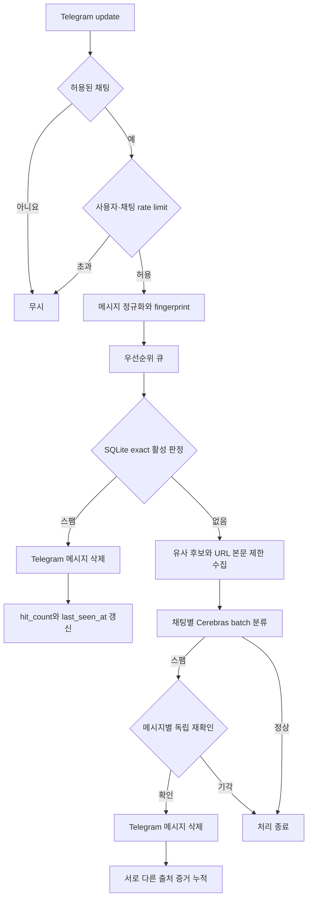
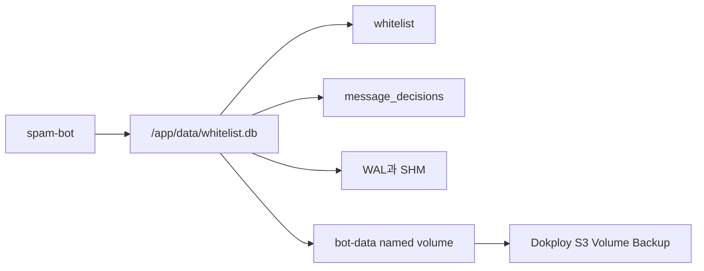
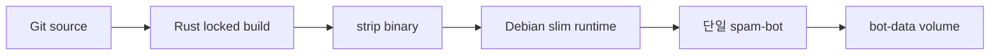
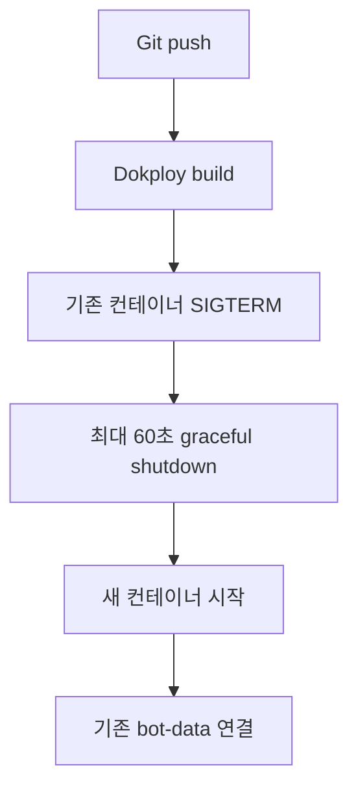

# 아키텍처

## 목표

- Telegram 그룹 메시지를 빠르게 수집하고 우선순위에 따라 처리합니다.
- 이미 확인된 스팸은 SQLite 캐시에서 판별해 LLM 호출을 줄입니다.
- 새로운 메시지만 웹 본문과 함께 Cerebras에 전달합니다.
- Docker와 Dokploy에서는 단일 replica와 영속 SQLite 볼륨을 사용합니다.

## 메시지 처리

캐시 조회가 실패하면 메시지를 정상으로 확정하지 않고 LLM 분류로 진행합니다. 정상 판정은 캐시하지 않습니다. 활성 상태인 채팅별 exact 스팸 판정만 자동 삭제하며 유사 후보는 같은 채팅의 LLM 재검증 근거로만 사용합니다. 일괄 판정에서 스팸으로 나온 메시지는 다른 메시지와 분리해 다시 확인한 뒤 삭제합니다. 최초 스팸 판정은 잠정 상태이며 서로 다른 익명화 출처의 두 번째 증거가 누적된 뒤 활성화됩니다.

## 모듈

| 모듈 | 책임 |
| --- | --- |
| `config` | 환경변수 파싱과 검증 |
| `telegram` | Telegram dispatcher와 관리 명령 |
| `tasks::queue` | 높은 우선순위와 일반 우선순위 큐 |
| `tasks::processor` | 캐시 조회, 웹 수집, AI 분류, 삭제 |
| `ai` | Cerebras 요청과 응답 파싱 |
| `web_content` | URL 검증, 제한 다운로드, 본문 추출 |
| `db::whitelist` | 허용 채팅 영속화 |
| `db::spam_cache` | exact hash와 유사 스팸 캐시 |
| `infrastructure` | 디렉터리, 로그, 종료, 단일 인스턴스 |
| `app` | 의존성 조립과 수명주기 |

## SQLite

하나의 SQLite 파일에 `whitelist`와 `message_decisions`를 저장합니다. 연결은 WAL 모드, 5초 busy timeout, 최대 5개 연결을 사용합니다.

WAL 파일과 SHM 파일은 DB와 같은 볼륨에 있어야 합니다. SQLite WAL은 네트워크 파일시스템을 지원하지 않으므로 named volume은 Dokploy가 실행되는 단일 호스트의 로컬 스토리지를 사용합니다.

새 판정 캐시는 원문과 출처 ID를 저장하지 않고 채팅 범위 해시, exact 해시, 비가역 SimHash, 판정, 증거 수, 정책 버전과 만료 시각만 저장합니다. 출처는 SHA-256으로 익명화하고 서로 다른 값만 증거로 계산합니다. 보안 마이그레이션은 이전 `spam_messages`와 복원 가능한 정규화 원문을 삭제하며 `secure_delete`를 활성화합니다.

## 컨테이너

Docker 이미지는 두 단계로 빌드합니다.

1. Rust builder가 `Cargo.lock`을 고정하고 프로젝트 전용 Cargo registry cache만 재사용합니다.
2. Debian slim runtime에는 strip한 바이너리와 CA 인증서만 복사합니다.

컨테이너는 UID/GID 10001로 실행하며 루트 파일시스템은 읽기 전용입니다. `/app/data`만 named volume으로 영속화하고 `/tmp`는 64MB tmpfs로 제한합니다.

Compose는 로컬 `image` 이름 없이 `build`만 사용합니다. Dokploy의 프로젝트별 Compose 이미지 이름을 사용해 다른 서비스와의 태그 충돌을 피합니다.

## Dokploy 수명주기

Telegram long polling과 로컬 SQLite는 동시에 여러 replica를 실행하는 구조가 아닙니다. Dokploy Compose 서비스는 replica 1개를 유지합니다.

컨테이너 내부 예약 재시작과 자동 업데이트는 비활성화합니다. Docker의 `restart: unless-stopped`와 Dokploy 재배포가 프로세스 수명주기를 관리합니다.

Compose에는 HTTP 포트와 도메인이 없습니다. Telegram, Cerebras, 외부 URL에 대한 outbound 연결만 필요하며 Traefik 네트워크에 연결하지 않습니다.

## 로그와 상태 확인

운영 로그의 기준은 stdout입니다. Docker `json-file` 드라이버는 파일당 10MB, 최대 3개로 순환합니다. Dokploy 로그 뷰어에서 같은 로그를 확인할 수 있습니다.

Compose는 파일 로그를 비활성화합니다. 초기화에 필요한 `LOGS_DIR`는 `/tmp/logs`로 두며 장기 보존이 필요하면 stdout 로그를 외부 수집기로 전달합니다.

전용 `healthcheck` 명령은 처리 루프 heartbeat의 최근 갱신 시각과 SQLite `PRAGMA quick_check`를 검사합니다. Compose는 30초마다 실행하고 시작 후 60초의 준비 시간을 허용합니다. URL 수집과 AI 재시도 중에도 heartbeat를 갱신하며 4분 이상 갱신되지 않으면 비정상으로 판단합니다.

## 백업과 복구

Dokploy Volume Backup은 `bot-data` named volume을 S3에 저장합니다. 실행 중인 SQLite 볼륨을 파일 단위로 복사하면 일관되지 않을 수 있으므로 `Turn off Container` 옵션을 활성화합니다.

복구할 때는 컨테이너를 중지하고 대상 볼륨이 사용 중이지 않은 상태에서 복원합니다. Dokploy 애플리케이션 이름이나 Compose project name을 변경하면 실제 볼륨 이름이 달라질 수 있으므로 배포 식별자를 유지합니다.

## 운영 제약

- replica는 1개만 사용합니다.
- `bot-data`를 NFS나 CIFS에 두지 않습니다.
- `AUTO_UPDATE_ENABLED=false`를 유지합니다.
- `RESTART_CRONS`는 빈 값으로 유지합니다.
- 비밀값은 Dokploy Environment에만 저장합니다.
- `docker compose down -v`는 운영 환경에서 실행하지 않습니다.
